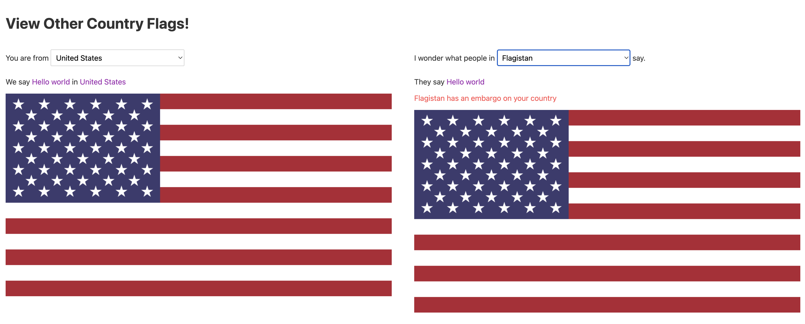
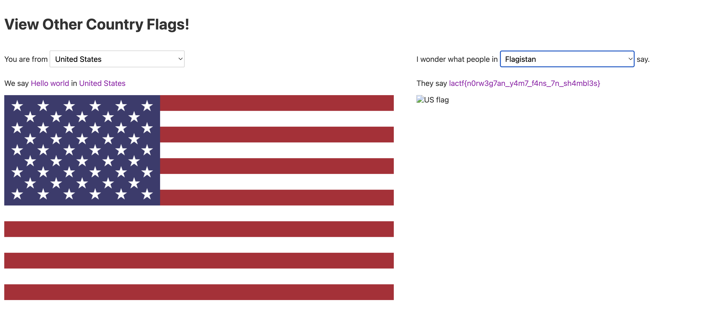

# Flag Land

We first just play around with the website to see what it does


It seems like a translation service from Hello world in English


If we scroll through all the country options, we notice ```Flagistan``` at the very top!


If we click on this and see the translate we will be given the flag



Or do we, this was very suprising to see since I didn't encouter this issue during the challenge but all you have to do is reset cookies and be in the United States.




```lactf{n0rw3g7an_y4m7_f4ns_7n_sh4mbl3s}```